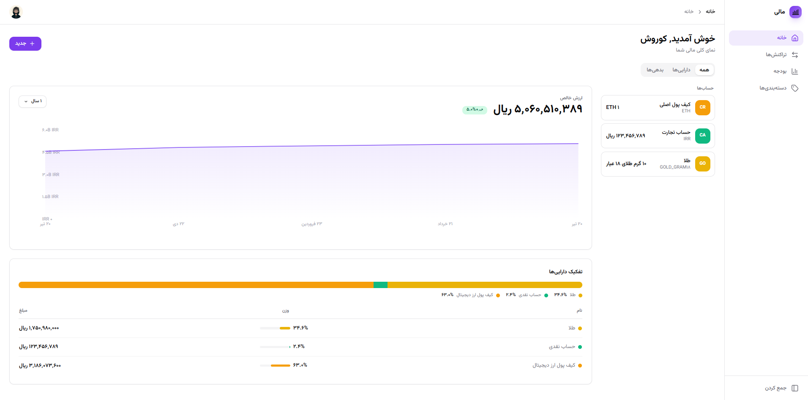

<div align="center">

# 💰 Personal Finance Dashboard

**A modern, bilingual personal finance dashboard — track accounts, monitor net worth, manage budgets, and control your financial life.**

[](https://reactjs.org/)
[](https://www.typescriptlang.org/)
[](https://tailwindcss.com/)
[](https://pages.cloudflare.com/)
[](https://developers.cloudflare.com/d1/)
[](LICENSE)



</div>

---

## ✨ Features

| Feature | Description |
|---------|-------------|
| 🔐 **Access Code Auth** | No email/password — login with a generated code (XXXX-XXXX format) + optional 2FA |
| 📊 **Net Worth Dashboard** | Real-time area chart with date range filters (30D / 90D / 1Y / ALL) |
| 💳 **Multi-Account Tracking** | Cash, investments, crypto, gold, property, vehicles, credit cards, loans |
| 📝 **Transaction Management** | Income, expenses, transfers with categories, notes, and file attachments |
| 📈 **Budget Tracking** | Monthly spending limits with visual progress bars |
| 💱 **Multi-Currency** | 50+ fiat currencies + 15+ cryptocurrencies with live exchange rates |
| 🪙 **Gold Valuation** | Automatic gold value calculation using live prices (24K/22K/18K) |
| 📱 **Responsive Design** | Optimized for desktop, tablet, and mobile |
| 🌐 **Bilingual** | Full English and Persian (فارسی) support with RTL layout |
| 🌙 **Dark Mode** | Beautiful dark theme with system preference detection |
| 🔒 **Two-Factor Auth** | Google Authenticator TOTP integration |
| 📎 **File Attachments** | Attach images and documents to transactions |

---

## 🛠 Tech Stack

| Layer | Technology |
|-------|-----------|
| **Frontend** | React 18, Vite 5, TypeScript, Tailwind CSS 3, Recharts |
| **UI Components** | Radix UI (Dialog, Select, Tabs), Lucide Icons, CVA |
| **Backend** | Cloudflare Pages Functions (Workers) |
| **Database** | Cloudflare D1 (SQLite) |
| **Cache** | Cloudflare KV (rate limiting) |
| **Auth** | Custom access code system with TOTP 2FA |
| **i18n** | Built-in English/Persian with RTL support |

---

## 🚀 Quick Start

### Prerequisites

- [Node.js](https://nodejs.org/) 18+
- [Cloudflare account](https://dash.cloudflare.com/) (for deployment)

### Local Development

```bash
# Install dependencies
npm install

# Reset DB + start dev server (fresh start)
npm run db:reset && npm run dev
```

This runs on **http://localhost:8789** with a local D1 database, KV namespace, and all API endpoints.

### First Time Setup

```bash
# Install dependencies
npm install

# Initialize database tables
npm run db:init

# Seed demo data (optional)
npm run db:seed

# Start dev server
npm run dev
```

### Reset Database

```bash
rm -rf .wrangler && npm run db:reset && npm run dev
```

---

## 🏗 Project Structure

```
cf-personal-finance/
├── functions/                  # Cloudflare Pages Functions (API)
│   ├── api/
│   │   ├── _lib/              # Auth helpers, defaults
│   │   ├── auth/              # Login, register, logout, 2FA
│   │   ├── accounts/          # Account CRUD
│   │   ├── transactions/      # Transaction CRUD (with search)
│   │   ├── budgets/           # Budget CRUD
│   │   ├── attachments.ts     # File upload/download
│   │   ├── categories.ts      # Category CRUD
│   │   ├── currencies.ts      # Currency list
│   │   ├── net-worth.ts       # Net worth aggregation
│   │   ├── settings.ts        # User settings
│   │   ├── export.ts          # Data export
│   │   └── import.ts          # Data import
├── migrations/                 # D1 SQL migrations
│   ├── 0001_init.sql          # Core schema
│   ├── 0002_seed.sql          # Demo data
│   └── 0003_attachments.sql   # Attachments table
├── src/
│   ├── components/
│   │   ├── ui/                # shadcn/ui components (Button, Card, Dialog, Badge, etc.)
│   │   ├── AuthModal.tsx      # Full-page login/register/2FA
│   │   ├── Layout.tsx         # App shell with sidebar
│   │   ├── Sidebar.tsx        # Navigation with logo
│   │   └── ...
│   ├── pages/
│   │   ├── Dashboard.tsx      # Net worth + accounts overview
│   │   ├── Transactions.tsx   # Transaction list with search/filter/sort
│   │   ├── Budgets.tsx        # Budget management
│   │   ├── Categories.tsx     # Category management
│   │   └── Settings.tsx       # Profile, import/export, 2FA, preferences
│   ├── hooks/                 # React hooks (useAuth, useAccounts, etc.)
│   ├── lib/                   # i18n, utils, currencies, theme
│   └── api/client.ts          # API client
├── wrangler.toml              # Cloudflare configuration
├── tailwind.config.ts         # Tailwind + shadcn/ui tokens
└── vite.config.ts
```

---

## 📡 API Endpoints

| Method | Endpoint | Description |
|--------|----------|-------------|
| `POST` | `/api/auth/register` | Create account, get access code |
| `POST` | `/api/auth/login` | Login with code (+ optional TOTP) |
| `POST` | `/api/auth/logout` | Clear session |
| `GET` | `/api/auth/me` | Get current user |
| `POST` | `/api/auth/2fa` | Enable 2FA (generate QR secret) |
| `PUT` | `/api/auth/2fa` | Verify/enable/disable 2FA |
| `GET` | `/api/accounts` | List all accounts |
| `POST` | `/api/accounts` | Create account |
| `PUT` | `/api/accounts/:id` | Update account |
| `DELETE` | `/api/accounts/:id` | Delete account |
| `GET` | `/api/transactions` | List (filterable, sortable, paginated) |
| `POST` | `/api/transactions` | Create transaction |
| `PUT` | `/api/transactions/:id` | Update transaction (adjusts balances) |
| `DELETE` | `/api/transactions/:id` | Delete transaction (reverses balances) |
| `POST` | `/api/attachments` | Upload file attachment |
| `GET` | `/api/attachments` | List attachments for transaction |
| `GET` | `/api/attachments?id=xxx&action=data` | Download attachment file |
| `GET` | `/api/budgets` | List budgets |
| `POST` | `/api/budgets` | Create budget |
| `PUT` | `/api/budgets/:id` | Update budget |
| `DELETE` | `/api/budgets/:id` | Delete budget |
| `GET` | `/api/net-worth` | Net worth with history (`?range=30d\|90d\|1y\|all`) |
| `GET` | `/api/categories` | List categories |
| `POST` | `/api/categories` | Create category |
| `PUT` | `/api/categories?id=xxx` | Update category |
| `DELETE` | `/api/categories?id=xxx` | Delete category |
| `GET` | `/api/currencies` | Supported currencies |
| `GET` | `/api/settings` | Get user settings |
| `PUT` | `/api/settings` | Update settings |
| `GET` | `/api/export` | Export all data as JSON |
| `POST` | `/api/import` | Import from JSON |
| `DELETE` | `/api/account` | Delete entire account |
| `POST` | `/api/account/reset` | Reset account data |
| `GET` | `/api/convert` | Currency conversion |

---

## 🌐 Internationalization

The app supports **English** and **Persian (فارسی)** with full RTL layout:

- Language toggle on the login page
- All UI text translated in both languages
- Persian numerals (۰-۹) in Persian mode
- Proper RTL layout for sidebar, tables, forms, and modals
- Language preference persisted in localStorage

---

## 🔒 Security

- **Access Code Auth** — No passwords, just a generated 8-character code
- **2FA Support** — Google Authenticator TOTP with QR code setup
- **Session-based** — HttpOnly cookies for session management
- **Rate Limiting** — 20 login attempts per minute per IP (via KV)
- **Input Validation** — Server-side validation on all endpoints
- **CORS** — Same-origin requests only (frontend + API on same domain)

---

## 📦 Deployment

### Create Cloudflare Resources

```bash
# D1 database
wrangler d1 create personal-finance-db
# → Update database_id in wrangler.toml

# KV namespace
wrangler kv:namespace create RATE_CACHE
# → Update id in wrangler.toml

# Session signing key
wrangler secret put SESSION_SIGNING_KEY
```

### Initialize & Deploy

```bash
# Initialize remote database
npm run db:init:remote
npm run db:seed:remote  # optional

# Deploy
npm run deploy
```

---

## 📝 License

MIT
